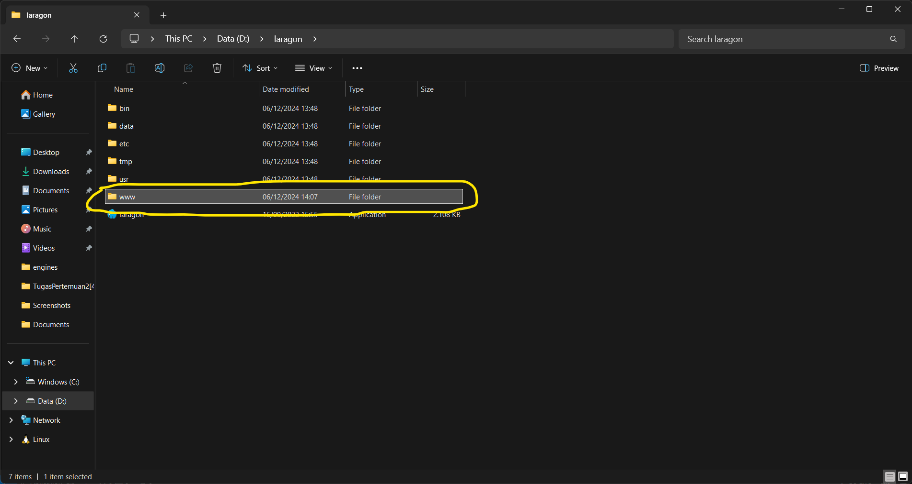
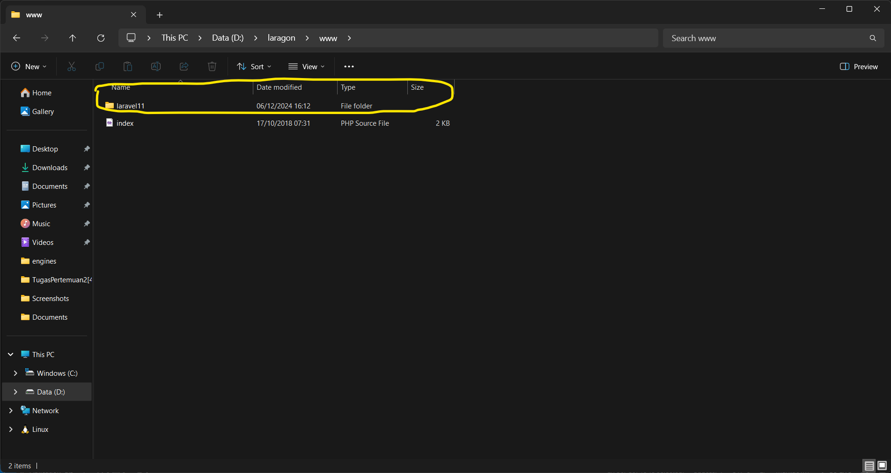
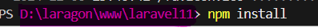

# Instalasi
## Aplikasi yang dibutuhkan

- Node Js version 22.12.0
- Composer
- php version 8.4.1 **[link php](https://windows.php.net/download#php-8.4)** download yang **Thread Safe**
- laragon [link laragon](https://laragon.org/download/)
- Table Plus [link table plus](https://tableplus.com/download)

:memo: **Note:** cara install nodejs, php, etc, di laragon nya gimana bisa lihat tutorial youtube [di sini](https://www.youtube.com/watch?v=nW60yGRoUrs&list=PLFIM0718LjIW1Xb7cVj7LdAr32ATDQMdr&index=2).

## Cara install Laravel

Karna kita pake laravel, dan sudah ada jadi tinggal **Pull** aja

- Buat folder file baru di dalam **Laragon/www**
    - Struktur folder laragon
    
    - lalu buat folder **laravel11**
    
- Kalau dah bisa tinggal pull aja lewat git bash atau download & extract 
- jika sudah tinggal execute command `npm install` di terminal vscode

--
:memo: **Note:** *perlu diperhatikan struktur folder sebelum `npm isntall`*.

- Sudah terinstall tinggal coba di running `php artisan serve`

